

# SSOC (쏙)

 
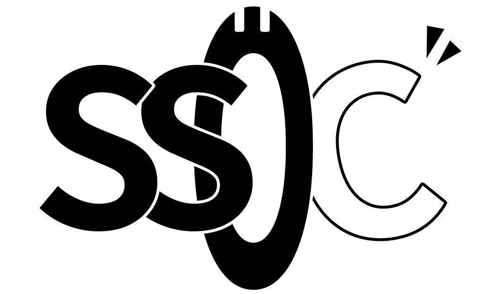
  

**세종대학교 동아리 모집 프로세스 관리 플랫폼**

'SSOC(쏙)'은 기존의 파편화된 동아리 모집 프로세스를 일원화 합니다. 
동아리 모집과 운영을 하나의 플랫폼에서 관리해보세요!

 

## 🌟 서비스 소개

**SSOC**은 동아리 관리자와 학생들을 위한 **동아리 지원 통합 관리 플랫폼**입니다. 
동아리 정보 등록부터 모집 공고, 지원서 수집, 평가/면접, 합격자 발표, 공지 및 알림까지  모집 운영의 전 과정을 표준화합니다.

### ✅ 한눈에 보기

| 대상               | 주요 행위                                              | SSOC가 주는 이점                          |
| ------------------ | ------------------------------------------------------ | ----------------------------------------- |
| **관리자(동아리)** | 공고 작성·편집, 지원자 평가, 면접 슬롯/메일, 합불 발표 | 절차 표준화, 일괄 처리로 운영 리소스 절감 |
| **학생(지원자)**   | 동아리 탐색, 지원서 제출, 면접 예약, 결과 확인         | 직관적 UX, 예측 가능한 흐름               |

 

## 🖥️ SSOC 기능 목록

### SSOC 지원자 페이지

 

|                          동아리 조회                           |
| :------------------------------------------------------------: |
| 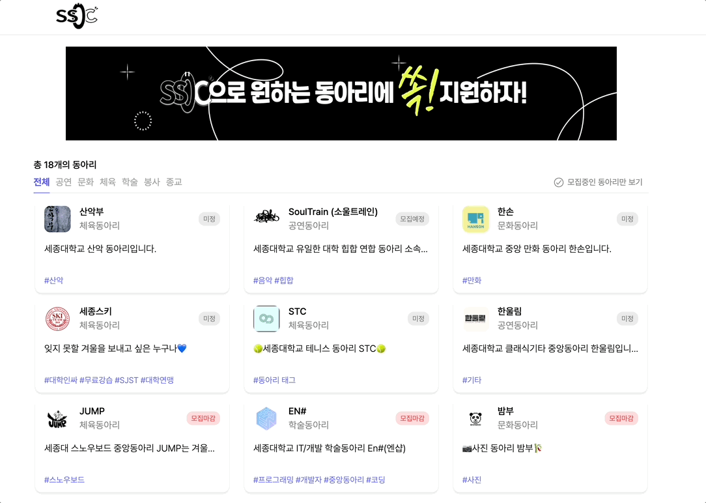 |
|                       SSOC의 메인 페이지                       |

- 세종대학교의 동아리 정보를 한 곳에서 확인할 수 있습니다.
- 필터 기능을 활용해 분과별 동아리 조회가 가능합니다.
- 현재 모집 중인 동아리 또한 필터를 통해 조회가 가능합니다.
- 상단 배너를 통해 총동아리연합회 등에서 공지하는 각 종 행사 및 공고를 확인할 수 있습니다.

 

|                        동아리 세부 조회                        |
| :------------------------------------------------------------: |
|  |
|                    동아리 정보 및 공고 조회                    |

- 각 동아리의 세부 정보를 확인할 수 있습니다.
- 선택한 동아리에서 어떤 지원자를 모집하는지 공고 목록을 확인할 수 있습니다.
- 공고에 대한 세부 정보를 확인 후 원하는 동아리에 지원이 가능합니다.

 

|                           동아리 지원                           |
| :-------------------------------------------------------------: |
| 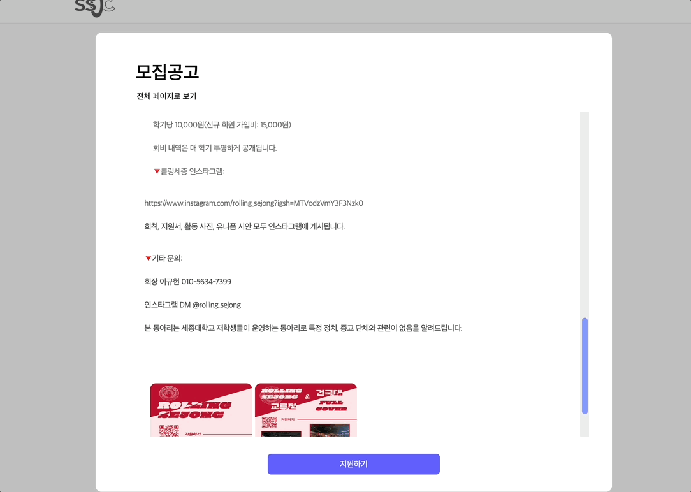 |
|                       동아리 지원 폼 작성                       |

- 동아리 지원할 때 필요한 개인정보 제공 동의 항목에 대한 세부 정보를 확인할 수 있습니다.
- 사전에 동아리 관리자가 작성한 지원서 폼을 바탕으로 지원서를 작성 후 제출합니다.
- 제출 여부는 후에 작성한 이메일로 발송됩니다.

 

### SSOC 관리자 페이지

|                          동아리 정보 관리                           |
| :-----------------------------------------------------------------: |
| 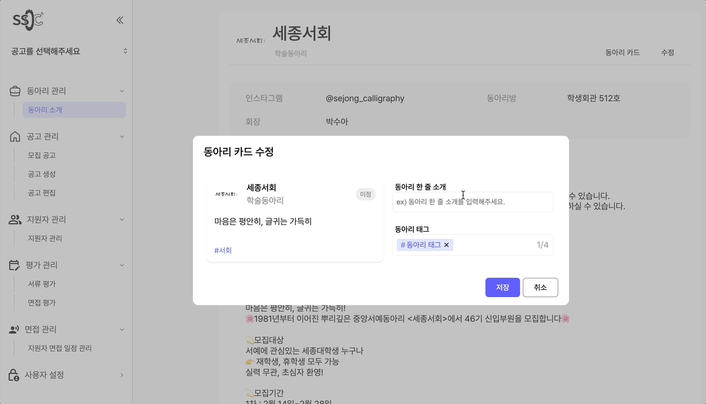 |
|                메인페이지에 보여질 동아리 정보 편집                 |

- 메인 페이지에서 학생(지원자)들이 확인할 동아리에 대한 정보를 직접 편집할 수 있습니다.
- 상세 정보, 회장 이름, 동아리방 위치 등 다양한 정보를 항목 별로 기입할 수 있습니다.

 

|                        동아리 모집 공고 생성 - 1                        |
| :---------------------------------------------------------------------: |
| 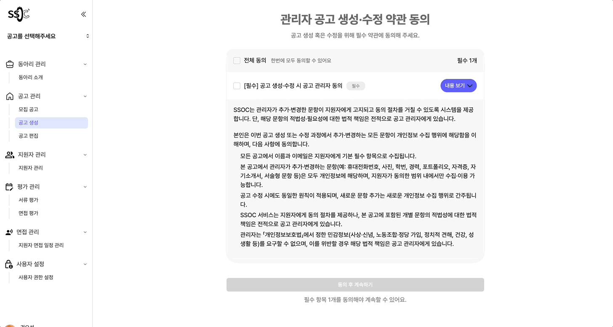 |
|                    동아리 지원 폼 중 공고 정보 작성                     |

|                        동아리 모집 공고 생성 - 2                        |
| :---------------------------------------------------------------------: |
| 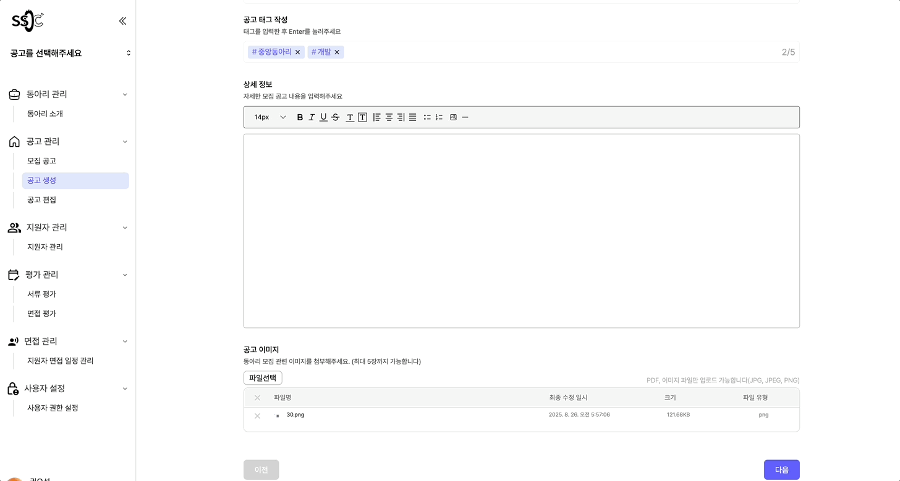 |
|               동아리 지원 폼 중 사전질문, 자기소개서 작성               |

|                        동아리 모집 공고 생성 - 3                        |
| :---------------------------------------------------------------------: |
| 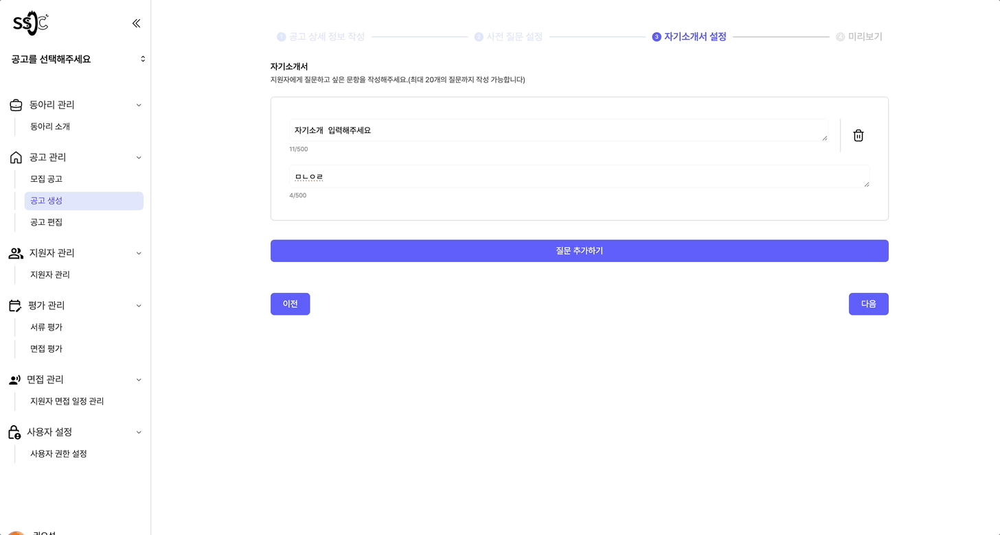 |
|                 동아리 지원 폼 중 미리보기 및 최종 완성                 |

- 공고 생성 관련된 필수 약관 동의 항목을 확인할 수 있습니다.
- 공고 제목, 각 세부 정보, 홍보 이미지 등 원하는 정보를 각 항목 별로 기입할 수 있습니다.
- 지원자의 인적사항과 추가적인 사전 질문을 유형(객관식, 주관식, 첨부파일) 별로 선택하여 작성할 수 있습니다.
- 자기소개서 문항 또한 자유롭게 작성 가능합니다.
- 미리보기 기능을 통해 수정할 부분을 바로 확인할 수 있습니다.

 

|                      동아리 지원자 관리 - 1                      |
| :--------------------------------------------------------------: |
| 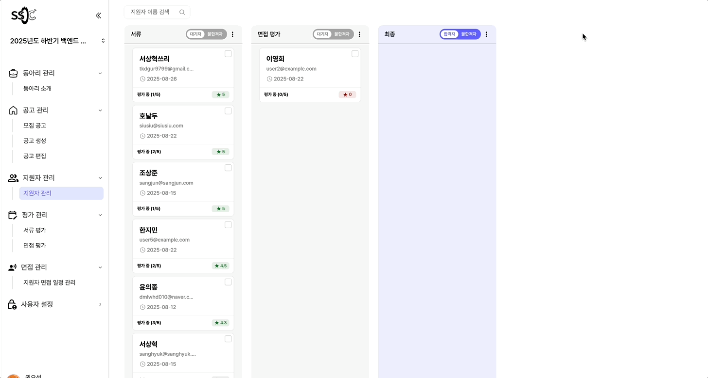 |
|           지원자들 각 step 별로 관리 및 합불 여부 결정           |

|                      동아리 지원자 관리 - 2                      |
| :--------------------------------------------------------------: |
| 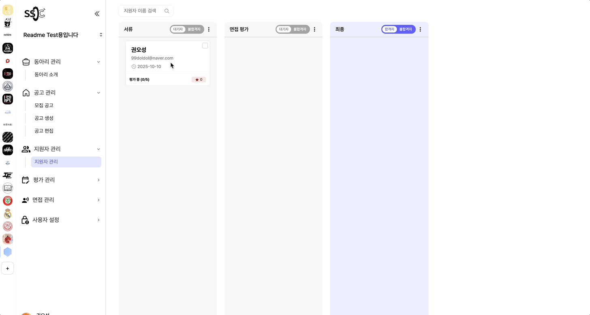 |
|                     합불 여부 관련 메일 전송                     |

|                      동아리 지원자 관리 - 3                      |
| :--------------------------------------------------------------: |
| 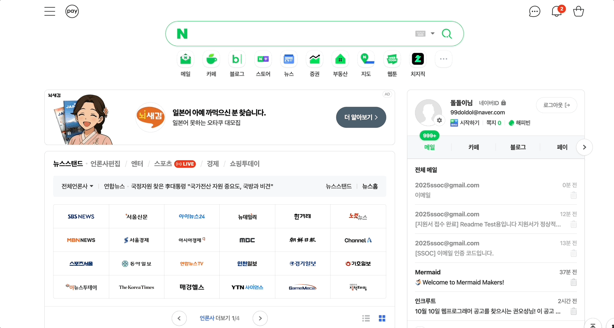 |
|              지원자 이메일에서 해당 메일 확인 가능               |

- 각 스텝(서류, 면접 등)별로 지원자를 한눈에 확인할 수 있습니다.
- 각 지원자가 작성한 서류를 확인할 수 있습니다.
- 지원자의 합불 여부를 결정하고, 해당 결과를 이메일로 전송할 수 있습니다.

 

|                          동아리 지원자 평가                          |
| :------------------------------------------------------------------: |
| 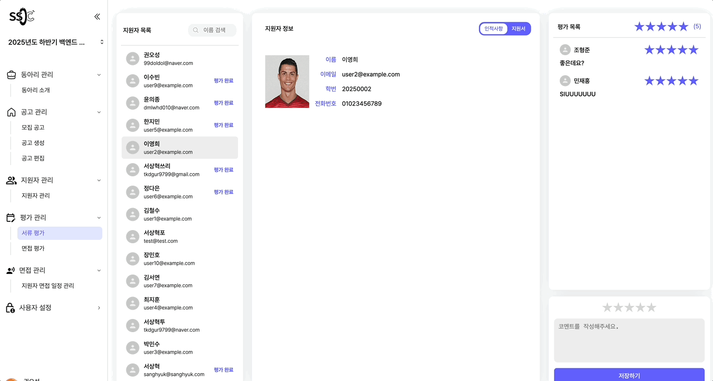 |
|          지원자의 서류 및 면접을 관리자들이 평가하는 페이지          |

- 각 지원자의 지원서를 바탕으로 점수와 간단한 코멘트를 작성해 남길 수 있습니다.
- 면접 또한 별도의 점수 및 코멘트를 작성할 수 있습니다.

|                        동아리 면접 일정 관리                        |
| :-----------------------------------------------------------------: |
| 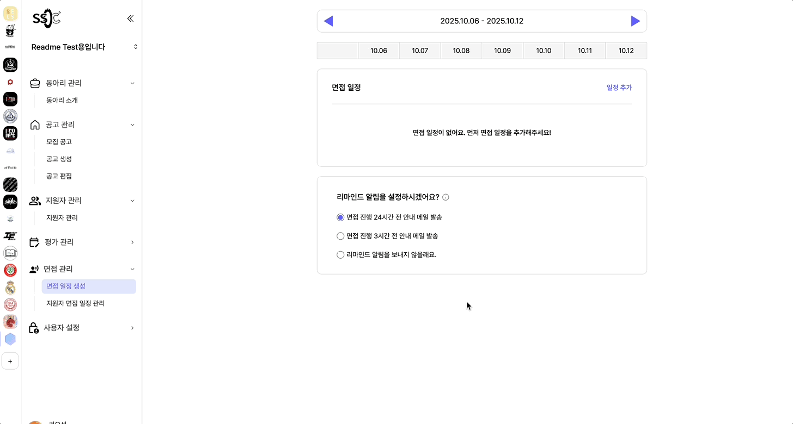 |
|                        면접 일정 설정 페이지                        |

- 면접 시간 간격, 면접 당 보는 인원, 면접 날짜와 시간을 선택할 수 있습니다.
- 대시보드에서 설정된 면접 일정을 한눈에 확인 가능합니다.
- 면접 일정을 추가하거나 삭제할 수 있습니다.

 

|                        지원자 면접 일정 관리                        |
| :-----------------------------------------------------------------: |
|  |
|            지원자 면접 일정을 직접 설정할 수 있는 페이지            |

- 미처 면접 예약을 못했거나 특수한 상황인 경우, 관리자가 직접 지원자들의 면접 일정을 조정할 수 있습니다.

   

## 📲 서비스 이용하기

| 항목                        | 사이트 접속하기                                                                                             |
| --------------------------- | ----------------------------------------------------------------------------------------------------------- |
| **SSOC URL**                | [SSOC 사이트 바로가기](https://ssoc.kr/)                                                                    |
| **Admin SSOC URL**          | [Admin SSOC 사이트 바로가기](https://admin.ssoc.kr/)                                                        |
| **관리자 서비스 설명 문서** | [서비스 설명 문서 바로 이동하기](https://sangjunn.notion.site/SSOC-261976a7f2238089ab88de63e0fe78a1?pvs=74) |

 

## 🧭 로드맵

| 기간            | 주요 항목                                     | 정리된 문서 확인                                                                                                                                                                         |
| --------------- | --------------------------------------------- | ---------------------------------------------------------------------------------------------------------------------------------------------------------------------------------------- |
| **0 ~ 1개월**   | 기획 및 디자인                                | [와이어프레임 바로가기](https://www.figma.com/design/bRET7spZWHW3tV6oKcD3fg/Recruiting-Your-Club--%EB%94%94%EC%9E%90%EC%9D%B8-%ED%94%84%EB%A1%9C%ED%86%A0%ED%83%80%EC%9E%85?node-id=0-1) |
| **1 ~ 2개월**   | 공통 컴포넌트 개발 , API 개발                 | [PR 확인하기](https://github.com/Recruiting-Your-Club/ryc/pulls?q=is%3Apr+is%3Aclosed)                                                                                                   |
| **2 ~ 5개월**   | API 연결 및 페이지 개발 , API 개발            | [PR 확인하기](https://github.com/Recruiting-Your-Club/ryc/pulls?q=is%3Apr+is%3Aclosed)                                                                                                   |
| **5 ~ 6개월**   | QA                                            | [QA BUGLIST 확인하기](https://sangjunn.notion.site/Bug-List-25e976a7f22380909d1af032a2935c6f?pvs=74)                                                                                     |
| **6 ~ 7개월**   | 서비스 홍보 및 사용자 유치                    |
| **정기적 회의** | 안건 건의 및 진행상황 공유를 위한 정기적 회의 | [정기 회의록 확인하기](https://sangjunn.notion.site/18e976a7f22380bea053feaba5e15826)                                                                                                    |

 

## ⭐️ 개발 팀원

### Front-End

|              FE-Developer               |              FE-Developer              |             FE-Developer              |              FE-Developer               |
| :-------------------------------------: | :------------------------------------: | :-----------------------------------: | :-------------------------------------: |
|                 이미지                  |                 이미지                 |                이미지                 |                 이미지                  |
| [권오성](https://github.com/ohsung0722) | [김영림](https://github.com/littleemm) | [윤의종](https://github.com/Dochanii) | [조준희](https://github.com/aiminghee3) |

### Back-End

|             BE-Developer              |                BE-Developer                |              BE-Developer               |
| :-----------------------------------: | :----------------------------------------: | :-------------------------------------: |
|                이미지                 |                   이미지                   |                 이미지                  |
| [김시원](https://github.com/Huro0906) | [서상혁](https://github.com/SangHyeok0908) | [조상준](https://github.com/sangjun121) |
